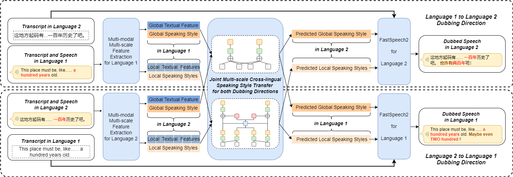

<!-- 
# Joint Multi-scale Cross-lingual Speaking Style Transfer with Bidirectional Attention Mechanism for Automatic Dubbing

# Abstract

Automatic dubbing, which generates a corresponding version of the input speech in another language, could be widely utilized in many real-world scenarios such as video and game localization. In addition to synthesizing the translated scripts, automatic dubbing needs to further transfer the speaking style in the original language to the dubbed speeches
to give audiences the impression that the characters are speaking in their native tongue.
However, state-of-the-art automatic dubbing systems only model the transfer on duration and speaking rate, neglecting the other aspects in speaking style such as emotion, intonation and emphasis which are also crucial to fully perform the characters and speech understanding. 
In this paper, we propose a joint multi-scale cross-lingual speaking style transfer framework to simultaneously model the bidirectional speaking style transfer between languages at both global (i.e. utterance level) and local (i.e. word level) scales.
The global and local speaking styles in each language are extracted and utilized to predicted the global and local speaking styles in the other language with an encoder-decoder framework for each direction and a shared bidirectional attention mechanism for both directions.
A multi-scale speaking style enhanced FastSpeech 2 is then utilized to synthesize the predicted the global and local speaking styles to speech for each language. Experiment results demonstrate the effectiveness of our proposed framework, which outperforms a baseline with only duration transfer in both objective and subjective evaluations.

    
     
    
 Fig.1: The the proposed joint multi-scale cross-lingual speaking style transfer model. 

 -->

<!-- # Subjective Evaluation -->

To demonstrate that our proposed model can significantly transfer the cross-lingual speaking styles both in global and local from source speech to the synthesized speech, some samples are provided for comparison.   **Source Speech** means the source speech in the original language, reconstructed by a vocoder. **FastSpeech 2** means an open-source implementation of FastSpeech 2, with no speaking style transfer. **Duration Tansfer** means duration tansfer model, which predicts the duration of every word in the target speech. **Joint Style Transfer** means the proposed model, which predicts joint multi-scale cross-lingual speaking style in the target speech. In addition, a well-trained HIFI-GAN is used as the vocoder to generate waveform.

## Transfer direction from English to Chinese

| Target Chinese Text | Source English Text | Source Speech | FastSpeech 2 | Duration Transfer | Joint Style Transfer (Proposed) |
| :---- | :---- | :---- | :---- | :---- | :---- |
| 有了这艘飞船，我们就能满世界追杀强盗啦！ | With this ship, we can kill bandits all over the worlds! | <audio controls><source src="./wavs/en_gt/940463570.wav" type="audio/wav">Your browser does not support the audio element.</audio> | <audio controls><source src="./wavs/en2zh_va/940463570.wav" type="audio/wav">Your browser does not support the audio element.</audio> | <audio controls><source src="./wavs/en2zh_dura/940463570.wav" type="audio/wav">Your browser does not support the audio element.</audio> | <audio controls><source src="./wavs/en2zh_pro/940463570.wav" type="audio/wav">Your browser does not support the audio element.</audio> |
| 空间可是越多越好， 所以赶快买买买吧！ | You're gonna need more space, so buy it already! | <audio controls><source src="./wavs/en_gt/390343119.wav" type="audio/wav">Your browser does not support the audio element.</audio> | <audio controls><source src="./wavs/en2zh_va/390343119.wav" type="audio/wav">Your browser does not support the audio element.</audio> | <audio controls><source src="./wavs/en2zh_dura/390343119.wav" type="audio/wav">Your browser does not support the audio element.</audio> | <audio controls><source src="./wavs/en2zh_pro/390343119.wav" type="audio/wav">Your browser does not support the audio element.</audio> |
| 我怎么会忘记我的强盗兄弟呢？ 见到你很高兴哦！ | How could I forget me bandit bro? Good to see ya! | <audio controls><source src="./wavs/en_gt/174177905.wav" type="audio/wav">Your browser does not support the audio element.</audio> | <audio controls><source src="./wavs/en2zh_va/174177905.wav" type="audio/wav">Your browser does not support the audio element.</audio> | <audio controls><source src="./wavs/en2zh_dura/174177905.wav" type="audio/wav">Your browser does not support the audio element.</audio> | <audio controls><source src="./wavs/en2zh_pro/174177905.wav" type="audio/wav">Your browser does not support the audio element.</audio> |
| 告诉你什么是我不怀念的吧：愤怒的蜥蜴。 在飞船上至少能躲开那些该死的臭虫。 | I'll tell you what I DON'T miss: angry saurians. At least we're safe from them big ol' bastards on this here ship. | <audio controls><source src="./wavs/en_gt/3062332819.wav" type="audio/wav">Your browser does not support the audio element.</audio> | <audio controls><source src="./wavs/en2zh_va/3062332819.wav" type="audio/wav">Your browser does not support the audio element.</audio> | <audio controls><source src="./wavs/en2zh_dura/3062332819.wav" type="audio/wav">Your browser does not support the audio element.</audio> | <audio controls><source src="./wavs/en2zh_pro/3062332819.wav" type="audio/wav">Your browser does not support the audio element.</audio> |
| 这就是当初将毁灭者封印起来的那台机器。 重要的是， 它还能再封印一次！ 但我们需要四把秘藏钥匙才能进去。 你已经有三把了， 对吧？ | This was the machine that locked away the Destroyer the first time. And it can do it again, too! But we need four Vault Keys to get in. You already got three of them, right? | <audio controls><source src="./wavs/en_gt/3717739556.wav" type="audio/wav">Your browser does not support the audio element.</audio> | <audio controls><source src="./wavs/en2zh_va/3717739556.wav" type="audio/wav">Your browser does not support the audio element.</audio> | <audio controls><source src="./wavs/en2zh_dura/3717739556.wav" type="audio/wav">Your browser does not support the audio element.</audio> | <audio controls><source src="./wavs/en2zh_pro/3717739556.wav" type="audio/wav">Your browser does not support the audio element.</audio> |
| 北面和南面都有敌人来袭， 大量机甲已经越过高墙！ | Contacts to the north and south! We've got mechs coming over the walls! | <audio controls><source src="./wavs/en_gt/462549853.wav" type="audio/wav">Your browser does not support the audio element.</audio> | <audio controls><source src="./wavs/en2zh_va/462549853.wav" type="audio/wav">Your browser does not support the audio element.</audio> | <audio controls><source src="./wavs/en2zh_dura/462549853.wav" type="audio/wav">Your browser does not support the audio element.</audio> | <audio controls><source src="./wavs/en2zh_pro/462549853.wav" type="audio/wav">Your browser does not support the audio element.</audio> |

## Transfer direction from Chinese to English

| Target English Text | Source Chinese Text | Source Speech | FastSpeech 2 | Duration Transfer | Joint Style Transfer (Proposed) |
| :---- | :---- | :---- | :---- | :---- | :---- |
| With this ship, we can kill bandits all over the worlds! | 有了这艘飞船，我们就能满世界追杀强盗啦！ | <audio controls><source src="./wavs/zh_gt/940463570.wav" type="audio/wav">Your browser does not support the audio element.</audio> | <audio controls><source src="./wavs/zh2en_va/940463570.wav" type="audio/wav">Your browser does not support the audio element.</audio> | <audio controls><source src="./wavs/zh2en_dura/940463570.wav" type="audio/wav">Your browser does not support the audio element.</audio> | <audio controls><source src="./wavs/zh2en_pro/940463570.wav" type="audio/wav">Your browser does not support the audio element.</audio> |
| You're gonna need more space, so buy it already! | 空间可是越多越好， 所以赶快买买买吧！ | <audio controls><source src="./wavs/zh_gt/390343119.wav" type="audio/wav">Your browser does not support the audio element.</audio> | <audio controls><source src="./wavs/zh2en_va/390343119.wav" type="audio/wav">Your browser does not support the audio element.</audio> | <audio controls><source src="./wavs/zh2en_dura/390343119.wav" type="audio/wav">Your browser does not support the audio element.</audio> | <audio controls><source src="./wavs/zh2en_pro/390343119.wav" type="audio/wav">Your browser does not support the audio element.</audio> |
| One step closer to your true potential! | 离你的真正潜力又近一步啦！ | <audio controls><source src="./wavs/zh_gt/893498186.wav" type="audio/wav">Your browser does not support the audio element.</audio> | <audio controls><source src="./wavs/zh2en_va/893498186.wav" type="audio/wav">Your browser does not support the audio element.</audio> | <audio controls><source src="./wavs/zh2en_dura/893498186.wav" type="audio/wav">Your browser does not support the audio element.</audio> | <audio controls><source src="./wavs/zh2en_pro/893498186.wav" type="audio/wav">Your browser does not support the audio element.</audio> |
| I'll tell you what I DON'T miss: angry saurians. At least we're safe from them big ol' bastards on this here ship. | 告诉你什么是我不怀念的吧：愤怒的蜥蜴。 在飞船上至少能躲开那些该死的臭虫。 | <audio controls><source src="./wavs/zh_gt/3062332819.wav" type="audio/wav">Your browser does not support the audio element.</audio> | <audio controls><source src="./wavs/zh2en_va/3062332819.wav" type="audio/wav">Your browser does not support the audio element.</audio> | <audio controls><source src="./wavs/zh2en_dura/3062332819.wav" type="audio/wav">Your browser does not support the audio element.</audio> | <audio controls><source src="./wavs/zh2en_pro/3062332819.wav" type="audio/wav">Your browser does not support the audio element.</audio> |
| Save me, Vault Hunter! | 快救我， 秘藏猎人！ | <audio controls><source src="./wavs/zh_gt/660931476.wav" type="audio/wav">Your browser does not support the audio element.</audio> | <audio controls><source src="./wavs/zh2en_va/660931476.wav" type="audio/wav">Your browser does not support the audio element.</audio> | <audio controls><source src="./wavs/zh2en_dura/660931476.wav" type="audio/wav">Your browser does not support the audio element.</audio> | <audio controls><source src="./wavs/zh2en_pro/660931476.wav" type="audio/wav">Your browser does not support the audio element.</audio> |
| Much appreciated, Beau! Keep them coming! We got a lot of hungry people back here. | 太感谢你了， 阿波！ 全都送过来吧！ 我这里还有很多人在挨饿呢。 | <audio controls><source src="./wavs/zh_gt/1260586180.wav" type="audio/wav">Your browser does not support the audio element.</audio> | <audio controls><source src="./wavs/zh2en_va/1260586180.wav" type="audio/wav">Your browser does not support the audio element.</audio> | <audio controls><source src="./wavs/zh2en_dura/1260586180.wav" type="audio/wav">Your browser does not support the audio element.</audio> | <audio controls><source src="./wavs/zh2en_pro/1260586180.wav" type="audio/wav">Your browser does not support the audio element.</audio> |

# Case Study

## Transfer direction from English to Chinese

| Model | Target Chinese Text | Audio | Mel-Spectrogram |
| ----- | ----- | ----- | :---: |
| Source Speech | With this ship, we can kill bandits all over the worlds! | <audio controls><source src="./wavs/en_gt/940463570.wav" type="audio/wav">Your browser does not support the audio element.</audio> |  |
| vanilla | 有了这艘飞船，我们就能满世界追杀强盗啦！ | <audio controls><source src="./wavs/en2zh_va/940463570.wav" type="audio/wav">Your browser does not support the audio element.</audio> |  |
| Duration Transfer | 有了这艘飞船，我们就能满世界追杀强盗啦！ | <audio controls><source src="./wavs/en2zh_dura/940463570.wav" type="audio/wav">Your browser does not support the audio element.</audio> |  |
| Joint Style Transfer (Proposed)  | 有了这艘飞船，我们就能满世界追杀强盗啦！ | <audio controls><source src="./wavs/en2zh_pro/940463570.wav" type="audio/wav">Your browser does not support the audio element.</audio> |  |

## Transfer direction from Chinese to English

| Model | Target Chinese Text | Audio | Mel-Spectrogram |
| ----- | ----- | ----- | :---: |
| Source Speech | 有了这艘飞船，我们就能满世界追杀强盗啦！ | <audio controls><source src="./wavs/zh_gt/940463570.wav" type="audio/wav">Your browser does not support the audio element.</audio> |  |
| vanilla | With this ship, we can kill bandits all over the worlds! | <audio controls><source src="./wavs/zh2en_va/940463570.wav" type="audio/wav">Your browser does not support the audio element.</audio> |  |
| Duration Transfer | With this ship, we can kill bandits all over the worlds! | <audio controls><source src="./wavs/zh2en_dura/940463570.wav" type="audio/wav">Your browser does not support the audio element.</audio> |  |
| Joint Style Transfer (Proposed)  | With this ship, we can kill bandits all over the worlds! | <audio controls><source src="./wavs/zh2en_pro/940463570.wav" type="audio/wav">Your browser does not support the audio element.</audio> |  |
